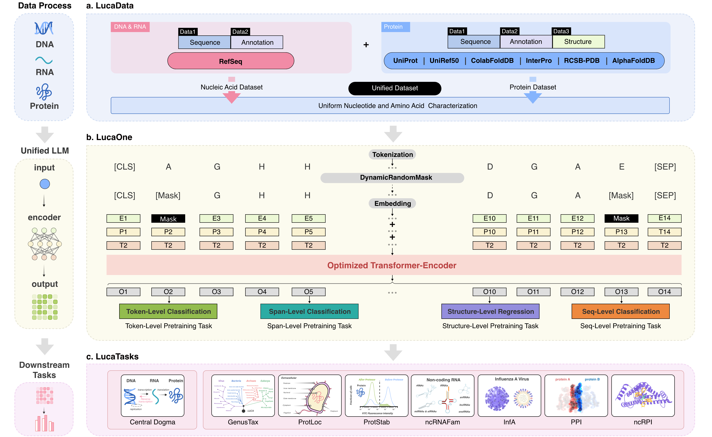
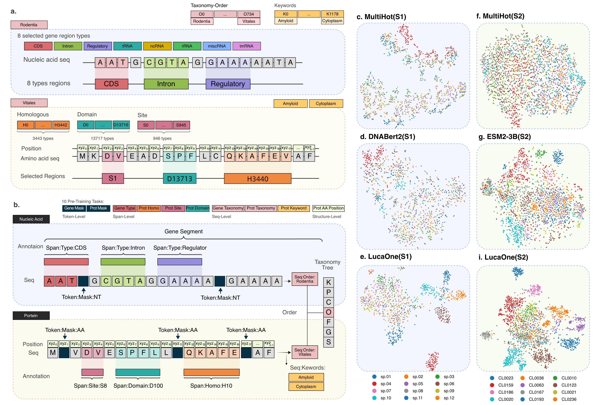
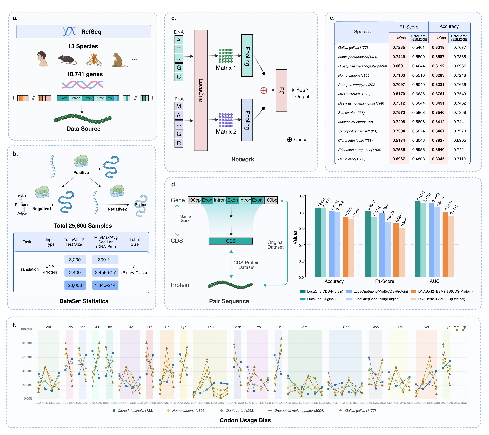
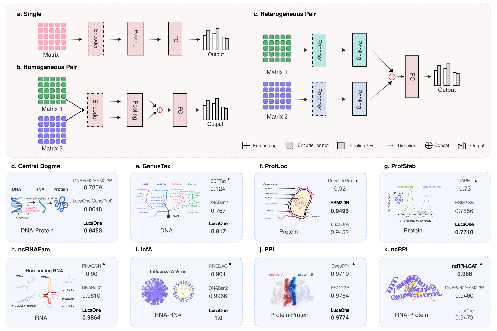

# LucaOne(LucaGPLM)     
LucaOne: Generalized Biological Foundation Model with Unified Nucleic Acid and Protein Language.   

# TimeLine     
* 2025/04/01:  
  * LucaOne         
  add `checkpoint=36000000` for LucaOne
  
  * LucaOne-Prot    
  add `checkpoint=30000000` for LucaOne-Prot(only trained using Protein)  
  
  * LucaOne-Gene     
  add `checkpoint=36800000` for LucaOne-Gene(only trained using DNA and RNA)    
  
* 2024/10/01: optimized embedding inference code: `src/get_embedding.py`      
* 2024/08/01: add `checkpoint=17600000`, location: <a href='http://47.93.21.181/lucaone/TrainedCheckPoint/models/lucagplm/v2.0/token_level,span_level,seq_level,structure_level/lucaone_gplm/20231125113045/checkpoint-step17600000/'>checkpoint-step17600000</a>   
* 2024/07/24: feature: add `continue training when failure`   

# Embedding Recommendation    
|    Task Type (Input Type)     |       LucaOne-Version       |                    LucaOne-CheckPoint                     |
|:-----------------------------:|:---------------------------:|:---------------------------------------------------------:|
| Only for Gene (i.e. DNA, RNA) | `LucaOne` or `LucaOne-Gene` | `36000000` for `LucaOne` `36800000` for LucaOne-Gene` |
|         Only for Prot         | `LucaOne` or `LucaOne-Prot` | `36000000` for `LucaOne` `30000000` for LucaOne-Prot` |
|  Gene (i.e. DNA, RNA) + Prot  |           `LucaOne`           |                 `36000000` for `LucaOne`                  |

## 1. LucaOne Workflow      

Fig. 1 The workflow of LucaOne.   

   

## 2. LucaOne PreTraining Data & PreTraining Tasks & Embedding(Zero-Shot)      

Fig. 2 The data and tasks for pre-training LucaOne, and T-SNE on four embedding models.     

## 3. Central Dogma(Few-Shot)    

Fig. 3 Learning Central Dogma of Molecular Biology.

## 4. Downstream Tasks(SFT)    

Fig. 4 Downstream task network with three input types and results comparison of 8 verification tasks.  

## 5. Environment Installation
### step1: update git
#### 1) centos
sudo yum update     
sudo yum install git-all

#### 2) ubuntu
sudo apt-get update     
sudo apt install git-all

### step2: install python 3.9
#### 1) download anaconda3
wget https://repo.anaconda.com/archive/Anaconda3-2022.05-Linux-x86_64.sh

#### 2) install conda
sh Anaconda3-2022.05-Linux-x86_64.sh
##### Notice: Select Yes to update ~/.bashrc
source ~/.bashrc

#### 3) create a virtual environment: python=3.9.13
conda create -n lucaone python=3.9.13

#### 4) activate lucaone
conda activate lucaone

### step3:  install other requirements
pip install -r requirements.txt -i https://pypi.tuna.tsinghua.edu.cn/simple   

## 6. Embedding Inference   
You can use the project: **<a href='https://github.com/LucaOne/LucaOneApp'>LucaOneApp Github</a> or <a href='http://47.93.21.181/lucaone/LucaOneApp'>LucaOneApp FTP</a>** for **embedding inference**. For details, please refer to the **`README`** of the LucaOneApp project.        

The project will download automatically LucaOne Trained-CheckPoint from **FTP**.     

## 7. For Downstream Tasks    
This project: **<a href='https://github.com/LucaOne/LucaOneTasks'>LucaOneTasks Github</a> or <a href='http://47.93.21.181/lucaone/LucaOneTasks'>LucaOneTasks FTP</a>** is all the downstream tasks used in our paper(**based on LucaOne's Embedding**), and you can use this project to run other tasks, please refer to the **`README`** of this project. 

## 8. Dataset   
Pretraining Dataset FTP: <a href='http://47.93.21.181/lucaone/PreTrainingDataset/dataset/lucagplm'>Dataset for LucaOne</a>     

Copy the dataset from <href> http://47.93.21.181/lucaone/PreTrainingDataset/dataset/lucagplm </href> into the directory: `./dataset/` 
 
The training dataset(`dataset/lucagplm/v2.0/train/`) whose file names start with **'2023112418163521'** are gene data(DNA + RNA), and those that start with **'2023112314061479'** are protein data.

The validation dataset(`dataset/lucagplm/v2.0/dev/`) whose file names start with **'2023112418224620'** are gene data(DNA + RNA), and those that start with **'2023112314080544'** are protein data.

The testing dataset(`dataset/lucagplm/v2.0/test/`) whose file names start with **'2023112418231445'** are gene data(DNA + RNA), and those that start with **'2023112314083364'** are protein data.

**Notice**     
If you want to train individual nucleic acid or protein LucaOne(LucaOne-Gene or LucaOne-Prot), please separate the datasets as described above.   

## 9. Training Scripts   
Training scripts are under the directory `src/training`, including 4 shell scripts:    
`run_multi_v2.0.sh`:  nucleic acid(DNA+RNA) and protein mixed training with 10 pre-training tasks.   
`run_multi_mask_v2.0.sh`:  nucleic acid(DNA+RNA) and protein mixed training with only 2 mask pre-training tasks.       
`run_multi_v2.0_gene.sh`:  individual nucleic acid training with 3 pre-training tasks.   
`run_multi_v2.0_prot.sh`:  individual protein training with 7 pre-training tasks.    

## 10. Continue Training when Failure     
`run_multi_v2.0_continue.sh`:  continue training when failure.  

## 11. Data and Code Availability     
**FTP:**   
Pre-training data, code, and trained checkpoint of LucaOne, embedding inference code, downstream validation tasks data & code, and other materials are available: <a href='http://47.93.21.181/lucaone/'>FTP</a>. 

**Details:**     

The LucaOne's model code is available at: <a href='https://github.com/LucaOne/LucaOne'>LucaOne Github </a> or <a href='http://47.93.21.181/lucaone/LucaOne/'>LucaOne</a>.   

The trained-checkpoint files are available at: <a href='http://47.93.21.181/lucaone/TrainedCheckPoint/'>TrainedCheckPoint</a>.  

LucaOne's representational inference code is available at: <a href='https://github.com/LucaOne/LucaOneApp'>LucaOneApp Github</a> or <a href='http://47.93.21.181/lucaone/LucaOneApp'>LucaOneApp</a>. 

The project of 8 downstream tasks is available at: <a href='https://github.com/LucaOne/LucaOneTasks'>LucaOneTasks Github</a> or <a href='http://47.93.21.181/lucaone/LucaOneTasks'>LucaOneTasks</a>.

The pre-training dataset of LucaOne is opened at: <a href='http://47.93.21.181/lucaone/PreTrainingDataset/'>PreTrainingDataset</a>. 

The datasets of downstream tasks are available at: <a href='http://47.93.21.181/lucaone/DownstreamTasksDataset/'> DownstreamTasksDataset </a>. 

The trained models of downstream tasks are available at: <a href='http://47.93.21.181/lucaone/DownstreamTasksTrainedModels/'> DownstreamTasksTrainedModels </a>.

Other supplementary materials are available at: <a href='http://47.93.21.181/lucaone/Others/'> Others </a>.

## 12. Contributor        
<a href="https://scholar.google.com.hk/citations?user=RDbqGTcAAAAJ&hl=en" title="Yong He">Yong He</a>, 
<a href="https://scholar.google.com/citations?user=lT3nelQAAAAJ&hl=en" title="Zhaorong Li">Zhaorong Li</a>, 
<a href="https://scholar.google.com/citations?view_op=list_works&hl=en&user=uvrzUfEAAAAJ" title="Yongtao Shan">Yongtao Shan</a>, 
<a href="https://scholar.google.com/citations?user=ODcOX4AAAAAJ&hl=zh-CN" title="Pan Fang">Pan Fang</a>, Yanhong Wei, 
<a href="https://scholar.google.com.hk/citations?hl=zh-CN&pli=1&user=Zhlg9QkAAAAJ" title="Yuan-Fei Pan">Yuan-Fei Pan</a>, 
<a href="https://scholar.google.com/citations?user=1KJOH7YAAAAJ&hl=zh-CN&oi=ao" title="Mang Shi">Mang Shi</a>, 
<a href="https://scholar.google.com/citations?hl=en&view_op=list_works&gmla=AGd7smFoGC01LG3CopJC_1HRW1Wpbk7W42IfwjCeac8GN2enJ8TEJ6t3JN5PVaugdD34CvNw3LJdUoWlY1XOpQ&user=Bd_HtNAAAAAJ" title="Jiaying Yang">Jiaying Yang</a>, 
<a href="https://scholar.google.com/citations?user=t0YyeMcAAAAJ&hl=zh-CN" title="Yihao Chen">Yihao Chen</a>,
<a href="https://scholar.google.com/citations?hl=en&user=ZmtOCdgAAAAJ" title="Yan Sun">Yan Sun</a>, Yuqi Liu  

## 13. Zenodo         
We have uploaded the model code, training scripts, and embedding inference scripts of LucaOne;    
The mode code, training and evaluation scripts, datasets, and trained models for downstream tasks,    
and additional supplementary materials to Zenodo (10.5281/zenodo.14977739).    
However, due to the substantial size of the pretraining dataset of LucaOne, it has not been included on Zenodo.     
Instead, it remains accessible via our publicly available FTP server (**<a href='http://47.93.21.181/lucaone/PreTrainingDataset/'>LucaOne Pretraining Dataset</a>**).     
We are actively seeking an open FTP platform with sufficient storage capacity to host our pretraining dataset.

**<a href='https://doi.org/10.5281/zenodo.14977739'>LucaOne Zenodo</a>**   

## 14. Citation         
**<a href='https://www.biorxiv.org/content/10.1101/2024.05.10.592927v1'>LucaOne Biorxiv</a>**   

@article {LucaOne,                
author = {Yong He and Pan Fang and Yongtao Shan and Yuanfei Pan and Yanhong Wei and Yichang Chen and Yihao Chen and Yi Liu and Zhenyu Zeng and Zhan Zhou and Feng Zhu and Edward C. Holmes and Jieping Ye and Jun Li and Yuelong Shu and Mang Shi and Zhaorong Li},     
title = {LucaOne: Generalized Biological Foundation Model with Unified Nucleic Acid and Protein Language},      
elocation-id = {2024.05.10.592927},        
year = {2024},         
doi = {10.1101/2024.05.10.592927},        
publisher = {Cold Spring Harbor Laboratory},        
URL = {https://www.biorxiv.org/content/early/2024/05/14/2024.05.10.592927 },        
eprint = {https://www.biorxiv.org/content/early/2024/05/14/2024.05.10.592927.full.pdf },        
journal = {bioRxiv}        
} 

## 15. LucaTeam

Fig. 5 LucaTeam at the West Lake in Hangzhou.

   

